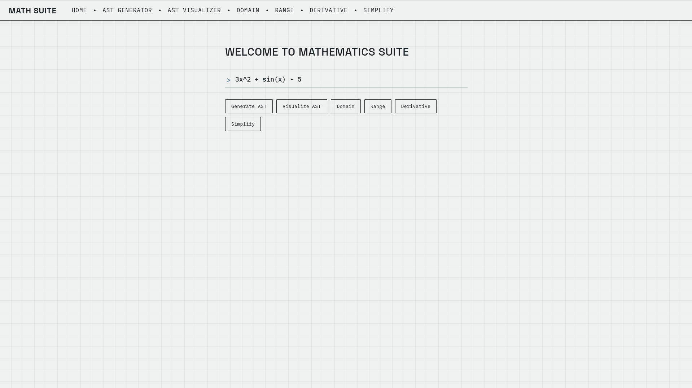

# MATH SUITE

## WHAT IS IT?

It is a mathematical toolkit built from scratch using python without any Sympy or ast module. The whole program is wrapped in a Flask frontend for a nice web UI. 6 available mathematical tools that link together to make the full "Mathematics suite".



## [TRY LIVE DEMO →](https://mathsuite-psi.vercel.app/)

## QUICK START

Open the link above and use the "try expression" buttons to get started. Or, write your own expressions and have fun.

## OBJECTIVE

My main objective with this project was to not use pre-built python libraries like Sympy or AST generating libraries and instead built everything from scratch. You would ask why do that? and I would say **why not**? What is better than learning about something by building it yourself and then checking what you could have done better. That was the premise of the project, due to which I chose to make my own parsing algorithm, and I can certainly say that I have learnt a lot. I have learnt more about recursion and Recursive Descent Parsing (RDP) than I could have ever learnt by watching any youtube video. The thing that helped me the most through my learning were all my [recursion testing files](tests) and I reccommend everyone to have a look at them at least once.

## FEATURES
In total, there are **6 features**:

- **AST Generator:** Uses the tokenizer and parser to create a predominantly left associated nested tuple AST.

- **AST Visualizer:** Resurses through the AST to generate a visual SVG representation of the Tree which is **downloadable**.

- **Domain Calculator:** It calculates the domain of functions using brute force substitution, bijection and interval method.

- **Range Calculator:** Finds range using differiation to find local maxima/ minima and check its critical points and uses domain's methods to solve intervals.

- **Simplify:** constant folding, like-term collection across nested chains, identity collapsing (×1, +0, ^0, etc.)

## LOCAL SETUP

### Requirements:
- Python 3.x
- Flask, python-dotenv

### Setup:
```
python -m venv .venv
source .venv/bin/activate
pip install flask python-dotenv
flask run
```

`.flaskenv` already points `FLASK_APP` at `api.index` and enables debug mode. No environment variables are required for local dev. Woohoo!

## HOW IT WORKS

The web UI utilizes flask with one blueprint per tool (`/domain`, `/range`, `/differentiate`, `/simplify`, `/ast-generator`, `/ast-visualizer`).

All the calculators have the same initial steps:

`tokenizer → parser → AST → simplifier → per-tool calculator`

### Breaking down the working of each part of the pipeline:

1. **Tokenizer:** The tokenizer is built on a simple for loop that takes in an expression and separates all the parts of an expression and returns a list. It is made to detect:
    - implicit multiplication.
    - number runs (for example: '1' is a single list entry and so is '123')
    - letter runs (for example: 'x' v/s 'sin' or any other letter runs)
    - unary negation v/s binary negation.

A practical example would be: `-2x + 3sin(x)`

`tokens = ['-', '2', '*', 'x', '+', '3', '*', 'sin', 'x']`

2. **Parser:** This is the main step in the ast generation process. It is full of recursion so i once again recommend everone to check my hand written [recursion tests 1](tests/recursion_test_1.txt), [2](tests/recursion_test_2.txt) and [3](tests/recursion_test_3.txt) because if you understand what I have done there then you would get a better idea about the algorithm than I could explain you in words. This is called Recursive Descent Parsing. In the parsing algorithm, we are basically making a chain of functions that call each other in each pass and track the position of the tokens list to create the AST out of them.

3. **AST Generator:** This is genuinely the algorithm that I love the most out of any other program that I wrote becase there is nothing better than looking at your creation come alive in front of you and also because I just love the approach I took to make this program. Basically, what we do is we first of recurse through the tree and assign positions to nodes. To do the assignment, we use a dictionary where we track the 'x' value (which is only incremented by a leaf node because in the end, the final width of the tree is decided by all the positions of a leaf node) and the depth (take it as the y coordinate or a node). Now, if we encounter a node with `len == 3`, we recurse into left and right of the node to assign its children positions and then logically, we give the parent of left and right an x position of the mid point of the x position of its children. for example if a node is `('+', '1', '2')` then first of all we recurse into its children (left, right) with an increased depth of +1 (because if you imagine, if it is a tree and we know there is 1 parent and 2 children then the parent should be at LEVEL-1 and the children should be at LEVEL-2) and assign them the positions first (always leaf nodes first because they decide the position of all the parent nodes. Thus, a good mental model would be thinking that we are generating the tree starting from the bottom and towards the top). After assigning x positions to the children, lets say `1 -> x = 1` and `2 -> x = 2` then the x positions of parent '+' should be the midpoint of 1 and 2 i.e. x = 0.5. Thus, through recursion we keep on building this dictionary keeping the items unique by assigning them unique IDs. Now we have the basic coordinate system for our tree. Next we just need to convert the arbitrary x and y points and turn them into pixel coordinates and then we can simply draw circles and lines to represent the tree. If you are wondering how are lines drawn, then here is the answer: for the dictionary of the parent, we also note its children's id too so while grawing the lines for parents we can simple access that can connect those two coordinates.

4. **Domain Calculator:** Alot of mathematical but fun stuff here. We first recurse through the AST and create a constraints list for each pre-defined constraint we encounter. After that we find critical points of the constriant's expression. We then test the intervals generated by checking if they satisfy the constraint. Finally once we have the intervals in the form of `(lo, hi, lo_incl, hi_incl)` we can simply union and intersect the required intervals to find the final domain. The main fun stuff lies in how the criitical points are found. I basically used a brute force method by using a window of points to evaluate the function by substituting in the value of x. We then note a critical point by either a sign flip or definition change. After we have the rough idea of where the point lies, we send that to the bisect function which does the same thing but keeps on shortening the window so that it could "zoom into" the value more and get a more precise value. Now there are of course a lot of edge cases to this approach like the fixed window size and more and I do think that changing the approach to something like Newton-Raphson's algorithm would be better. But, I will keep that update for the future because that also comes with its own complicated edge cases.

5. **Derivative calculator:** This was pretty simple to do as mosed of the derivatives have set formulas and the recursion is also simple to understand. we just look for specific cases and find their derivative. for example for a node with a `*` op, we can simply do `('+', ('*', differentiate_unsim(left), right), ('*', differentiate_unsim(right), left))` which is bassically the simple product formula `u'v + v'u`. The main thing that took time in this program was handling constants generated after the derivative. For example 2*x would generate a node `('+', ('*', '0', 'x'), ('*', '2', '1'))` which does not look pretty at all but is mathematically correct as the actual answer is `2`. So to simplify all of this, I started working on the simpplification pipeline in derivative.py itself.

6. **Simplify:** Building this took too many iterations and more time than I would have liked as an intermediate step but it did turn out great so here's how it works. first of all, the problem was that `*` and `+` are associative, so to simplify all of the numbers in a `*` chain even buried deep inside, we need some kind of way to flatten the node by the operator which would get all the numbers that should be merged at the same level. next, after we have everything as a flat list and not as a nested mess, we can decide how to merge them. For this, I went through many iterations and thought a lot about this and decided on a common structure of (coefficient, base, exponent) for each term. We take the flat list and turn each of it's items to this form. After that we can simply handle algebra in `marge_terms` by matching cases as per the operator. For example `(2.0, None, None)` and `(3.0, None, None)` would be merged as `(6.0, None, None)` for `op = '*'`. After that we can simply form the node for each term returned by `merged_term` and then finally combine all those terms back as a nested operator structure. But, you would think that if we are flattening by operator and we have something like:
`('*', '2', ('*', ('+', 'x', '0'), '1'))` then we would get the flattened list as `['2', ('+', 'x', '0'), '1']` and when we go down the whole simplification pipeline then the ('+', 'x', '0') would never get simplified to 'x' and we will get an unsimplified result: `('*', '2', ('+', 'x', '0'))` whereas the required result is `('*', '2', 'x')` and you would be completely correct. Which is why, there is the main top level function `simplify_initial` that is responsible for the whole breaking the node and recursing and it is the one that calls the whole `flatten -> form_terms -> merge_terms -> form_node -> rebuild` pipeline and due to recursion, the ('+', 'x', '0') node gets simplified indivisually in a recursive call before it is ever available for the '*' node call. I highly recommend checking out [recursion tests 4](tests/recursion_test_4.txt) and [5](tests/recursion_test_5.txt) to get a better understanding of what I mean.

7. **Range Calculator:** For this calculator, instead of sampling the function directly, we differentiate it first, find the critical points of the derivative (where the slope changes sign), and evaluate the original function only at those points plus the domain boundaries. That turns range-finding into "evaluate at a handful of meaningful points and stitch the pieces together" instead of dense brute-force sampling.

## BASIC SYNTAX

| **Function** | **Syntax** | **Example** |
| :-----------:| :---------:| :----------:|
| Trigonometric| sin(), cos(), tan(), cosec(), sec(), cot()| sin(3x^2 + 2)|
| Inverse-Trigonometric| arcsin(), arccos(), arctan(), arccosec(), arcsec(), arccot()| arcsin(3x^2 + 2)|
| Square root | sqrt() | sqrt(3x^2 + 2)|
| Logarithmic | *base-10*: log(), *base-e*: ln()| log(3x^2 + 2)|
| Absolute value | \|f(x)\| | \|3x^2 + 2\| |
| Greatest Integer | [f(x)] | [3x^2 + 2] |
| Fractional Part | {f(x)} | {3x^2 + 2} |
| Exponential | a^b | x^2 |
| Addition | a + b | x + 2 |
| Subtraction | a - b | x - 2 |
| Multiplication | *Explicit*: a*b, *Implicit*: ab| 2x or 2*x|
| Division | a/b | (3x^2)/(2sin(x^2)) |

### Rules:
1. 